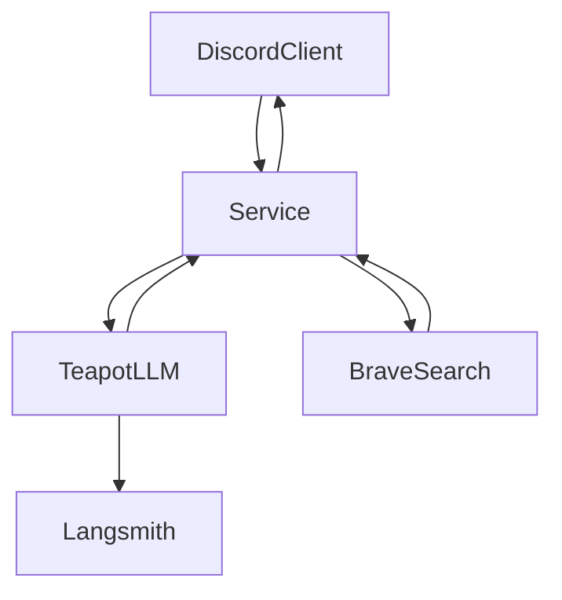

# Building a Discord Bot with TeapotLLM

## Introduction

TeapotLLM is an open-source, hallucination-resistant language model optimized to run entirely on CPUs, making it ideal for running low cost chatbots applications.

In this post, we’ll walk through building a Discord bot using TeapotLLM to answer frequently asked questions from a knowledge source. We’ll integrate retrieval-augmented generation (RAG) for document-based responses, utilize Brave Search for real-time context, and explore how to monitor performance using LangSmith.

Come join our [Discord](https://discord.gg/jvfjpGXu) to build along with us!


## High-Level Architecture

Our bot will follow a simple workflow:

1. A user asks a question in Discord.  
2. The bot checks its stored TeapotLLM documentation for relevant answers (RAG).  
3. If needed, it queries Brave Search for additional context.  
4. The response is generated using TeapotLLM and sent back to Discord.  

### Architecture Diagram:


## Setting Up a Discord Bot

To get started, install the necessary dependencies:

```bash
pip install discord.py teapotai
```

### Basic Discord Bot Code

First, let's write a simple python script that creates a Discord bot that responds with a simple "Hello, World!". The discord.py library makes it easy to set up an agent that will listen to messages and reply with a typing animation. Additionally, we ensure that we are not replying to our own messages to avoid an infinite loop. You'll need a bot token and a bot application installed on your server to get this running, follow the documentation [here](https://discord.com/developers/docs/quick-start/getting-started) to set that up.

```python
import discord
from discord.ext import commands

intents = discord.Intents.default()
intents.messages = True
bot = commands.Bot(command_prefix="!", intents=intents)

@bot.event
async def on_ready():
    print(f'Logged in as {bot.user}')

@bot.event
async def on_message(message):
    if message.author == bot.user:
        return
    async with message.channel.typing():
        await message.reply("Hello, World!")

bot.run("YOUR_DISCORD_BOT_TOKEN")
```


## Integrating TeapotLLM for FAQs

Now that we have our Discord bot set up, we can plug in the teapotai library to provide intelligent responses using our knowledge base. Teapotllm is a small model that can run on your CPU and has been trained to only answer using the provided documents to reduce hallucinations. The teapotai library automatically manages creating a local vector database for your documents and a RAG pipeline that can be used to provide the LLM with knowledge to answer user queries.


### Loading TeapotLLM with FAQ Documents

```python
from teapotai import TeapotAI, TeapotAISettings

documents = [
    "TeapotLLM is an open-source, hallucination-resistant model that runs on CPUs.",
    "TeapotLLM supports retrieval-augmented generation (RAG) for answering questions using documents.",
    "The model was trained on a synthetic dataset and optimized for efficient question answering.",
    "TeapotLLM is a fine tune of flan-t5-base that was trained on synthetic data generated by Deepseek v3",
    "TeapotLLM can be hosted on low-power devices with as little as 2GB of CPU RAM such as a Raspberry Pi.",
]

teapot_ai = TeapotAI(documents=documents, settings=TeapotAISettings(num_rag_results=3))
```

To ensure each document fits into the context, we split our documentation into logical chunks. this can be done automatically by parsing at paragraphs or page breaks, but will vary depending on your knowledge base's format. You can play with the document set up and examine how it impacts the RAG results. We've also configured the number of results to return for RAG to ensure we have enough context remaining for live search results.

### Querying TeapotLLM in the Discord Bot

Now that we've set up our knowledge base, we can invoke our teapot_ai instance within our Discord bot code. Here we are using the `teapot_ai.query()` method to respond to the user query. This method automatically pulls in relevant results from the RAG pipeline that will be used to I from the response.

```python
@bot.event
async def on_message(message):
    if message.author == bot.user:
        return
    async with message.channel.typing():
        answer = teapot_ai.query(
            query=message.content
        )
        await message.reply(answer)
```

## Integrating Brave Search for Additional Context

Our local teapotai instance now has the ability to answer using our knowledge base, but what if a user asks a more general question that is outside of the scope of our documents? That is where Brave Search comes in- we can perform a Brave Search with the user query and return the top result in the chat it's context; This ensures our model can answer questions about current events or other topics not covered by our RAG pipeline.

### Fetching Brave Search Results

```python
import requests

def search_brave(query):
    response = requests.get(f"https://api.search.brave.com/search?q={query}")
    return " ".join(result["snippet"] for result in response.json().get("results", []))
```

### Enhancing the Bot with Brave Search

We can drop any addition context information in the `context` parameter of our query method. This will always be included, regardless of what the RAG pipeline returns.

```python
@bot.event
async def on_message(message):
    if message.author == bot.user:
        return
    async with message.channel.typing():
        answer = teapot_ai.query(query=message.content, context=search_brave(message.content))
        await message.reply(answer)
```

## Deployment & Monitoring

Teapotllm is small enough to run on almost any device, as it requires ~2GB of RAM and can be run entirely on the CPU. Simply run your Discord bot code on a local laptop or hosted server. You should now be able to tag your chatbot in the server and watch it reply 


### Example Test Cases

To ensure accuracy before deployment, it's always good to select several test case questions to evaluate your model and RAG pipeline. We recommend picking at least 10 questions, preferably sourced from real users. Running a simple script like this allows us to validate that Teapot has the right data and configuration to effectively answer user questions.

```python
teapot_ai.query("What is TeapotLLM?") # =>
teapot_ai.query("How many parameters is teapotllm") # =>
teapot_ai.query("What devices can it run on") # =>
teapot_ai.query("Does Teapot AI support RAG pipelines?") # =>
teapot_ai.query("What model was teapotllm fine tuned off of?") # =>
teapot_ai.query("How was Deepseek used?") # =>
teapot_ai.queryHow many parameters does Deepseek have?") # =>

```

### Monitoring Performance with LangSmith

That's great that we now have some local test cases, but we want to ensure we can monitor performance when we deploy our chatbot to the real world. That is where [Langsmith](https://www.langchain.com/langsmith) comes in. Langsmith is a tool that makes it easy to track traces from your application to evaluate their latency and performance, and you can even use the responses to further fine-tune or validate your models.

Teapot AI natively supports langsmith in the library. Just add the following environment variables to automatically add any responses generated from your RAG pipeline.

```
LANGCHAIN_API_KEY=your_langsmith_api_key
LANGCHAIN_TRACING=true
LANGCHAIN_PROJECT=your_project_name
LANGCHAIN_ENDPOINT=https://api.smith.langchain.com

```

## Conclusion

By leveraging TeapotLLM, Teapot AI's RAG pipeline library and Brave Search, we’ve built a Discord bot capable of answering FAQs efficiently while running entirely on your CPU. TeapotLLM’s low resource usage allows it to run on low end devices like the Raspberry Pi, and with LangSmith, we can track performance and improve accuracy over time.

If you found this article interesting or need help with your project, we'd love to meet you in our [Discord](https://discord.gg/jvfjpGXu)!
