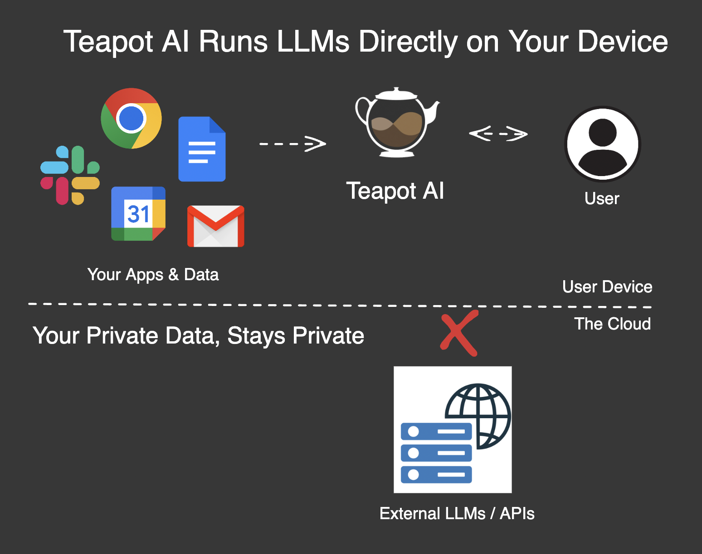

# 🫖 Teapot AI
### *Building AI-powered LLM agents, privately brewed in your browser.*

---

<!-- Announcement Banner -->

🚀 <strong>Announcement:</strong> TinyTeapotLLM Launched!
&nbsp; <a href="https://huggingface.co/teapotai/tinyteapot" style="font-weight:600; text-decoration:none;">
Check out the Model →
</a>

<!-- Short Org Description (1–2 sentences as requested) -->

TeapotAI is an open-source organization building small, efficient language models that can run anywhere —
on CPUs, mobile devices, and in the browser. Our models are designed for low latency, privacy, and real-world deployment.

<!-- Dual CTA Boxes -->

  <!-- Explore Models Box -->
  

    

      For Developers
    

    <h2 style="
    margin: 0 0 12px 0;
    font-size: 30px;
    color: #111827;
    ">
      🧠 Explore Models
    </h2>

    

      Browse TinyTeapot, TeapotLLM, and other open-source small LLMs optimized for fast local inference,
      RAG workflows, and grounded reasoning in production environments.
    

    <ul style="
    color: #374151;
    font-size: 14px;
    line-height: 1.8;
    padding-left: 18px;
    margin-bottom: 26px;
    ">
      <li>Ultra-low latency small language models</li>
      <li>Local CPU, mobile, and browser inference</li>
      <li>RAG, extraction, and classification support</li>
      <li>Fully open-source and community driven</li>
    </ul>

    <a href="/models" style="
      display: inline-block;
      background: #111827;
      color: #ffffff;
      padding: 14px 24px;
      border-radius: 999px;
      font-weight: 700;
      text-decoration: none;
      box-shadow: 0 16px 40px rgba(0,0,0,0.18);
      font-size: 15px;
    ">
      View Models →
    </a>

  

  <!-- Enterprise Box -->
  

    

      For Organizations
    

    <h2 style="
    margin: 0 0 12px 0;
    font-size: 30px;
    color: #111827;
    ">
      🏢 Enterprise & Deployment
    </h2>

    

      Partner with the TeapotAI team to deploy, fine-tune, and optimize lightweight LLMs
      for production systems, private AI environments, and large-scale applications.
    

    <ul style="
    color: #374151;
    font-size: 14px;
    line-height: 1.8;
    padding-left: 18px;
    margin-bottom: 26px;
    ">
      <li>Custom fine-tuning & model alignment</li>
      <li>Hosting & low-latency inference optimization</li>
      <li>Private / on-device AI deployments</li>
      <li>Evaluation, integration, and ongoing support</li>
    </ul>

    <a href="/enterprise" style="
      display: inline-block;
      background: #f3f4f6;
      color: #111827;
      padding: 14px 24px;
      border-radius: 999px;
      font-weight: 700;
      text-decoration: none;
      border: 2px solid #e5e7eb;
      font-size: 15px;
    ">
      Learn About Enterprise →
    </a>

  

---

# 🫖 Teapot LLM

Teapot is a small open-source language model (~800M parameters) fine-tuned on synthetic data and optimized to run locally on resource-constrained devices such as smartphones, browsers, and CPUs. It is built for grounded reasoning, efficient inference, and real-world AI deployment.

### Key Capabilities
- 📚 Hallucination-resistant Question Answering (Q&A)
- 🔎 Retrieval-Augmented Generation (RAG)
- 🧾 Structured JSON Extraction
- 🏷️ Text Classification & Tagging
- ⚡ Fast local inference on CPU and edge devices

