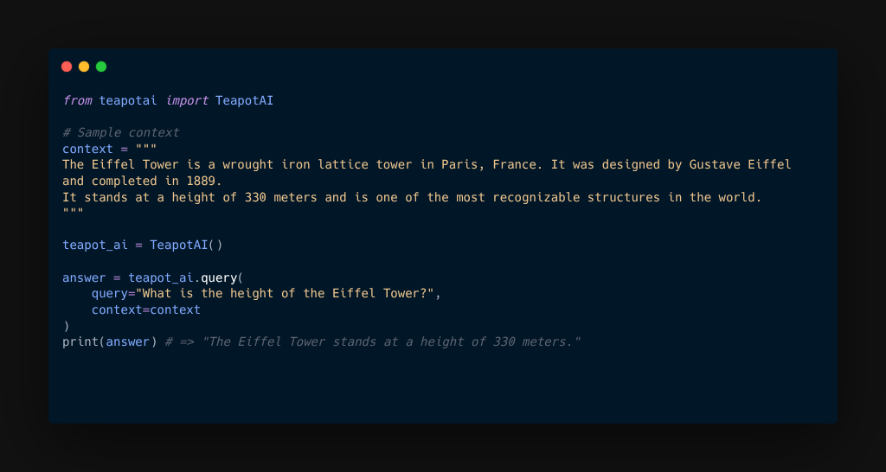

Announcement: Teapot LLM Launched!

# Teapot LLM
Teapot is a small open-source language model (~300 million parameters) fine-tuned on synthetic data and optimized to run locally on resource-constrained devices such as smartphones and CPUs. Teapot can perform a variety of tasks, including hallucination-resistant Question Answering (QnA), Retrieval-Augmented Generation (RAG), and JSON extraction. Teapot is a model built by and for the community.

Discover the capabilities.
