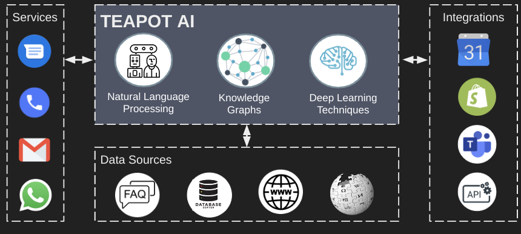

<style>
body{
    font-size:200%;
}
</style>

# Solutions
- Effortlessly chedule appointments
- Answer complex questions from your data
- Give up to date information from your website 

# How it works



## Teapot understands you Intent
Teapot uses an advanced AI trained on thousands of conversations that can understand the context behind what your customer is trying to accomplish, in natural language.


## Teapot understands your content
Teapot automatically crawls your website to pull relevant info into our search engine.
- Automatically parses images, text, PDFs, and website content
- Can redirect users to live content
- Works with any website or CMS


## Teapot understands your Customer 
Teapot keeps track of customers and their visits. It can remember names, and previous interactions to tailor your customer service experience to each person's needs.


# Example- Chatter Bot
<b>Chatter bot</b> | <b>Appointment Assistant</b> | <b>Leasing Agent</b>

<script src="./config.js"></script>
<script src="./teapot.js"></script>
<script id="teapot" src="./sdk.js"></script>


# Contact our Sales team today 
sales@teapotai.com


# Let's get Integrated
```javascript
<script id="teapot" src="https://teapotai.com/sdk?{API_KEY}"></script>
```